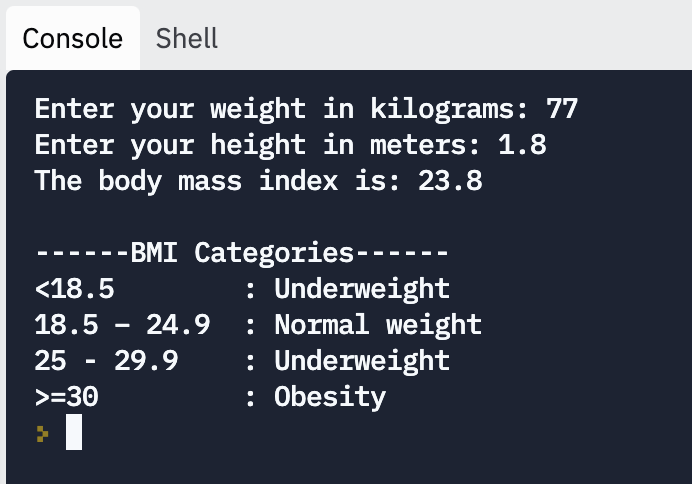

# Body Mass Index: Instructions  

Your task in this assignment is to create a body mass index calculator in Python. The program should ask the user for a person's weight and height, calculate the body mass index using the BMI formula, and output that value along with other meaningful information about body mass index.

Here's what a successful run of the program should look like:

## Steps

1. **Run the code**

If we have a starter code, it is always a good practice to run it first to get a sense of what the code does, whether it interprets successfully or not, and what type of runtime errors we get when we test it.

2. **Run the tests**

Click the checkmark button ✔ on the left panel and run the tests. You should see all the test cases fail. The starter code does not actually solve the problem.

3. **Write code to solve the problem**

Read the requirements carefully and write your solution in the `main.py` file. Follow the comments, and complete all the TODO items there.

4. **Test your solution**

Run the test cases and make sure your code passes all the test cases before submitting. If any case fails, read the case results carefully, and fix the problems before submitting.

5. **Double Check**

It is always a good practice to test your code before delivering it. In real life, you don't always have test cases to run; so you need to find a way to test your code.

One way to test your code is to compare the output of your program to the output from another program you know is right. You can find a tool that solves the same problem, feed the same input to the tool and your program, and compare your output with theirs.

This tool is an [online BMI calculator](https://www.nhlbi.nih.gov/health/educational/lose_wt/BMI/bmi-m.htm) you can use to compare your output.

(Make sure you select the metric measurement system.)

You can also use the self-check rubric below to check your code.

6. **Submit your assignment**

Use the button at the top right to submit your project for credit and feedback.

## Self-check Rubric

Use this checklist to confirm for yourself that your program works.

**Correctness**

- [ ]  Does your program pass the tests in Replit?
- [ ]  Does your program give the same results as the Online Calculator when you enter the same values?

**Code Quality**

- [ ]  Are your variables named meaningfully?
- [ ]  Does your program have clear explanatory comments?
- [ ]  Have you removed all the parts of the program that aren't explaining it or making it work?

## About BMI

> Body mass index is a value derived from the mass and height of a person. The BMI is defined as the body mass divided by the square of the body height and is expressed in units of kg/m², resulting from mass in kilograms and height in meters. 
~[Wikipedia](https://en.wikipedia.org/wiki/Body_mass_index)

Calculating the body mass index is useful for many medical cases. Plus, it makes a nice challenge for the skills you've learned so far, dealing with input, variables, and data types.

### BMI values and their meaning

* **Below 18.5**:	Underweight
* **18.5—24.9**:	Normal
* **25.0—29.9**:	Overweight
* **30.0 and Above**:	Obese
